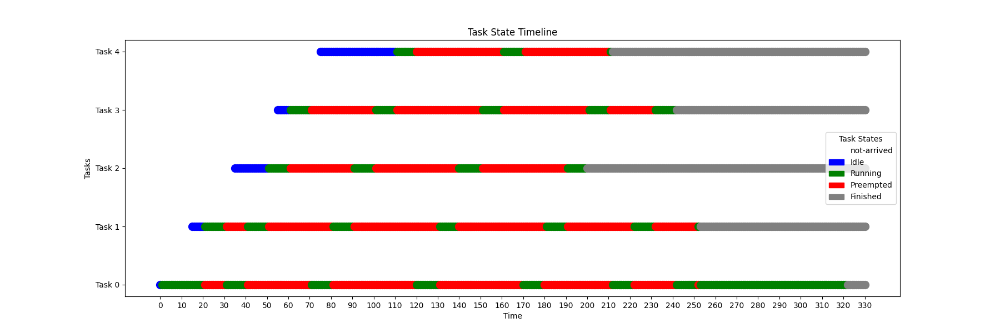
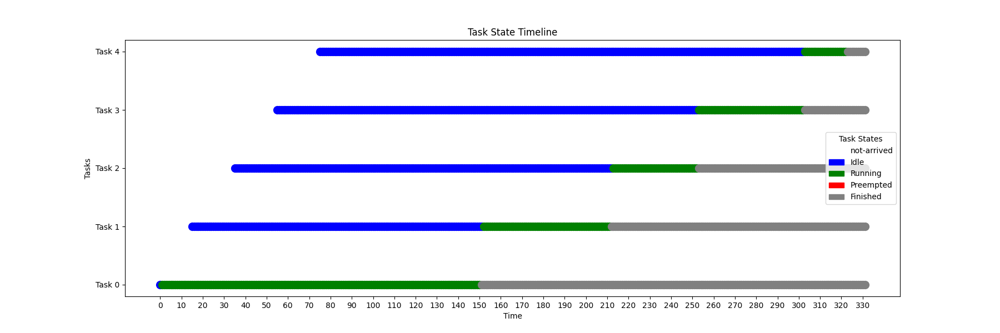
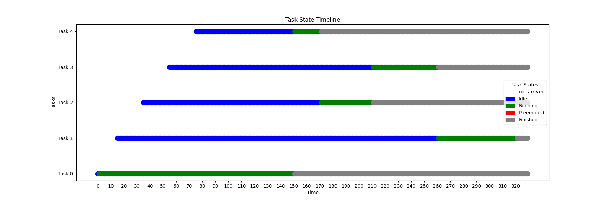
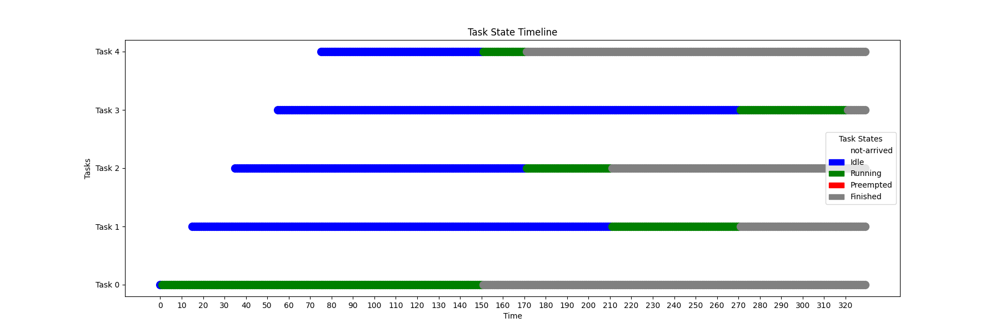
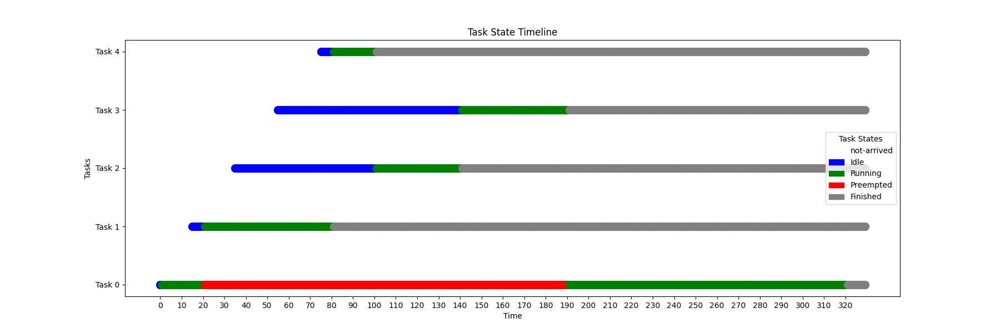
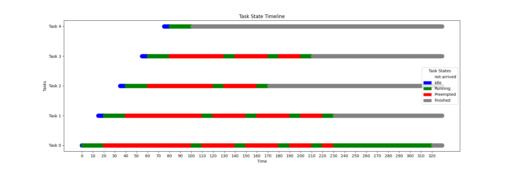

# Hei big kriss

## TASK A

Det jeg forventer av round robin, sånn som den er implemmentert er at den kjører task 0 litt, og så hopper til task 1 og så task 2 osv, selv om de ikke er ferdige, og så når den har kjørt task 4 litt så hopper den tilbake til task 0 og begynner ny syklus.

## TASK B

### FCFS

Her vil nok task 0 få kjøre ferdig før vi begynner på task 1 som får kjøre ferdig osv.

### SPN

Her tror jeg vi kommer til å velge prosessen som tar minst tid først, så 4,2,3,1,0 i den rekkefølge, men siden det tar litt tid før de andre taskene kommer så kan det hende den kjører 0 før den hopper til noen kortere.

### HRRN

Jeg tror HRRN vekter mellom ventetid så langt og hvor lang tid tasken tar, sånn at lange jobber ikke nødvendigvis trenger å vente til slutt som i SPN, jeg tipper task 0 kjører fullstendig først og så 4 og så en av 1,2 eller 3

## TASK C

### SRT

Dette er ikke en tv:) 

Er ikke dette basically det samme som SPN, men denne kan avbryte prosesser, så når den får inn ny task som vil bli ferdig før en den holder på med så bytter den til den kjappere tasken.

### FEED

Jeg tror denne vil se litt ut som RR etterhvert, men først vil den kjøre den nyeste tasken en kvant. Og hvis ikke ferdig vil degradere prioriteten på den + starte neste task hvis den eksisterer.

